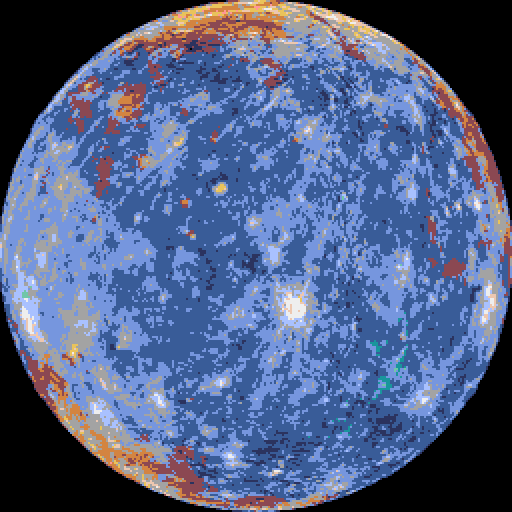
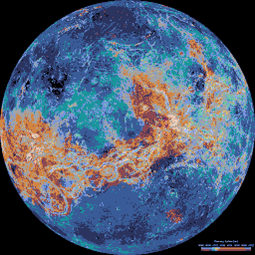
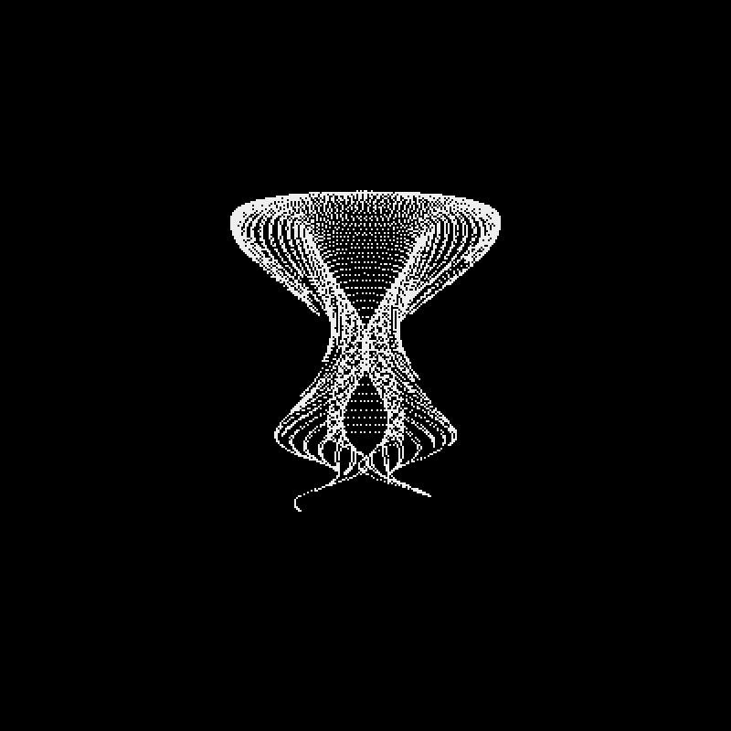
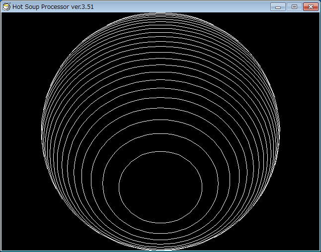
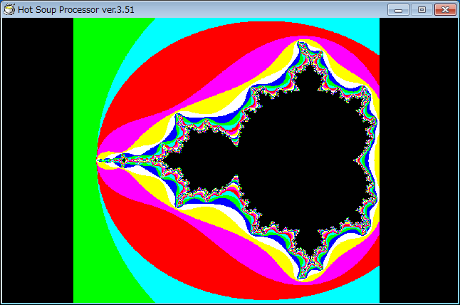
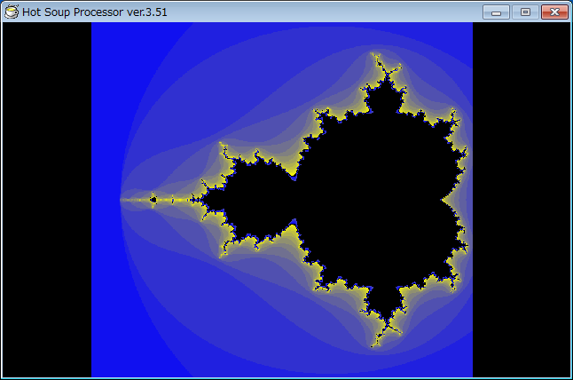
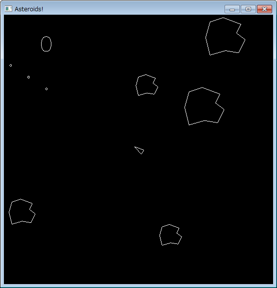
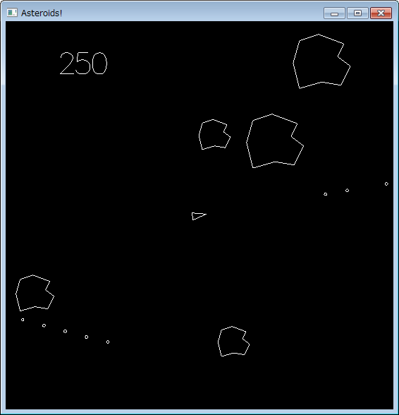
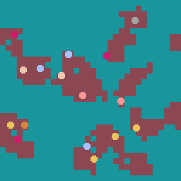

# Kumamoto

Games and demos. 
[HspNote in 2020](hsp/doc/200724_HspNote.md),
[AsteroidsNote in 2021](haskell/doc/210427_AsteroidsNote.md),
[PyxelNote in 2024](pyxel/doc/240420_PyxelNote.md) and
[GamesNote in 2017, 2018, 2019, 2020, 2021, 2022, 2023, 2024 and 2025](research/GamesNote.md) are here.

## Demo

|No.|Date|Title|Platform|Content|
|---|----|----|---------|-------|
|1|2026-01-11|[mercury](pyxel/mercury)|Pyxel||
|2|2026-01-16|[venus](pyxel/venus)|Pyxel||
|3|2026-09-22|[jellyfish](pyxel/jellyfish)|Pyxel||

## Miscellaneous

|No.|Date|Title|Platform|Content|
|---|----|----|---------|-------|
|1|2020-10-18|[ball](hsp/ball)|HSP||
|2|2020-10-24|[mandel](hsp/mandel)|HSP| |
|3|2021-08-28|[asteroids](haskell/asteroids)|Haskell| |
|4|2024-04-19|[sheep](pyxel/sheep)|Pyxel||
