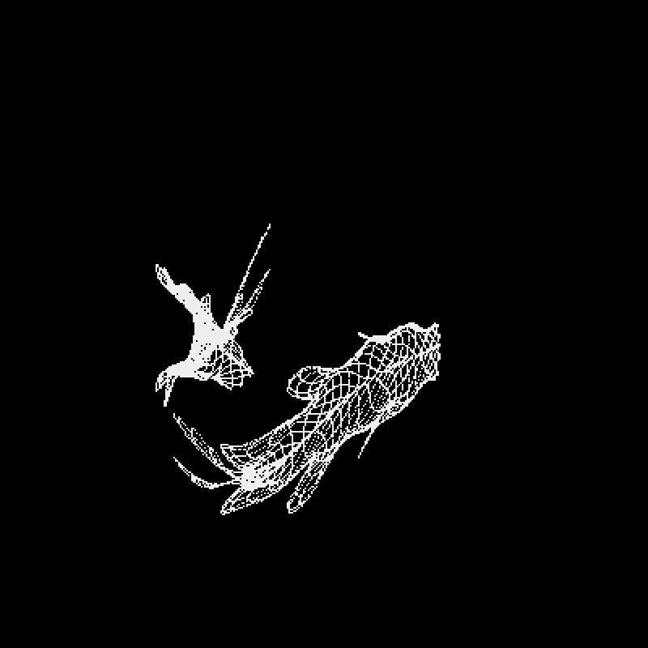

# Rendezvous Demo

## Introduction

It is a Rendezvous demo.
I ported Mr. @yuruyuau's [Tsubuyaki Processing](https://x.com/yuruyurau/status/2091203263811199186)to Pyxel/Python. 

 

## How to Run

Please execute the following from the Pyxel (version 2.9.9) environment.
Or you can play [here](https://kitao.github.io/pyxel/wasm/launcher/?run=jay-kumogata.Kumamoto.pyxel.rendezvous.rendezvous).

	> python rendezvous.py
	
## Remarks
